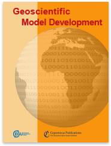

----- 

# Why reproducibility? 


## [Geoscientific Model Development (GMD) Guidelines](https://gmd.copernicus.org/articles/12/2215/2019/) 
  

GMD executive editors: Editorial: The publication of geoscientific model developments v1.2, Geosci. Model Dev., 12, 2215–2225, [DOI:10.5194/gmd-12-2215-2019](https://doi.org/10.5194/gmd-12-2215-2019), 2019.


**The GMD journal** in 2019 posted editorial guidelines regarding code and data policies. In this paper we want to address "Further steps towards best practice" (section 3). In the paper we can find that 
 
> _(...) it is not sufficient that the source code is provided. It is also necessary to have **access** to all of the **input data** (...) and all **model configuration files** are provided._

Next point in the same section mentions that manual processing is considered harmful

> _(...) challenge (...) occurs where model inputs or outputs have been manually processed by an author. (...) nobody, not even the author, can definitively know (...) how the results came about._

To avoid:
> _All figures and tables must be **scientifically reproducible from the scripts**._


```{attention} GMD Guidelines: 
Journals enforce redproducibility against archived releases (which is great!)
```
---
# Why notebooks?


##  _Why Jupyter is data scientists’ computational notebook of choice_
[Nature 563 (toolbox): Perkel 2018, DOI:10.1038/d41586-018-07196-1](https://doi.org/10.1038/d41586-018-07196-1)


If you're still asking yourself "Why notebooks?", here is a quote from Nature's paper:
> We went from Jupyter notebooks not existing some six years ago to in essence everybody using them today.


Here, we want to address challenges with Jupyter-notebooks, that are
> (...) difficult to organize code logically, break it into reusable modules and develop tests to ensure~the code is working properly

---

##  _Reactive, reproducible, collaborative: computational notebooks evolve_
[Nature 593: Perkel 2021 DOI:10.1038/d41586-021-01174-w](https://doi.org/10.1038/d41586-021-01174-w)


Three years after previous paper we can find another one (with above title). 

> A 2019 study found that just 24\% of 863,878 publicly available Jupyter notebooks on GitHub could be successfully re-executed, and only 4\% produced the same results.[^1]

[^1]:(J. F. Pimentel et al. in 2019 IEEE/ACM 16th International Conference on Mining Software Repositories (MSR) 507–517; IEEE, 2019)

---
# Can we do even better?

```{admonition} Even better!
The reproducibility maintained with ongoing developments
```

   In next sections you can find solutions developed in our packages.

---
